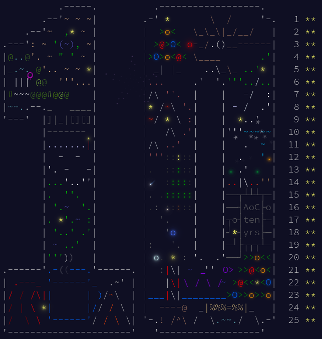

# [Advent of code 2025](https://adventofcode.com/2024) (TypeScript)

- `main.ts`: entry point
- `io/`: utilities to read/print i/o files
- `days/`: solutions for each day
- `inputFiles/`: input files (excluded from the repo)
- `outputFiles/`: output file for day 14 (excluded from the repo)

## Running solutions

```bash
npx ts-node main.ts day<dayNumber> runs the specific day

npx ts-node main.ts day<dayNumber>Part<partNumber> runs the specific part of the day
```
---

